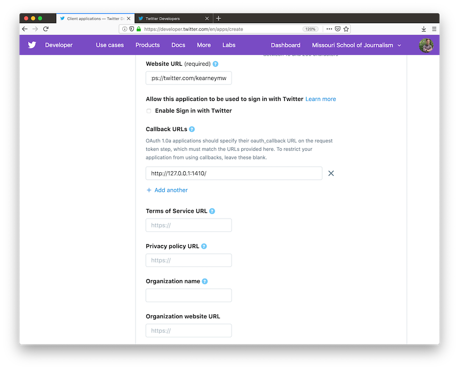
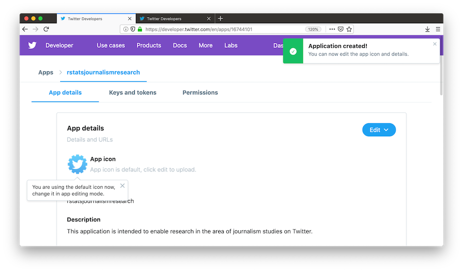
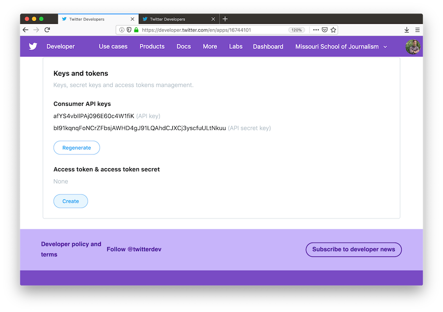

# Big-Data Lab (February 06): Twitter data

This practical session is devoted to exploring a Twitter dataset. We pick up from whenerver you left off last week (different people got to different points), so the instructions below start back from the beginning.

## Introduction

### Objectives of this lab
This tutorial will cover the following:
- Analyze Twitter data – from an archived dataset
- If you want to access Twitter API yourself (not required), you’ll need your Twitter account (see below).

### Background to Twitter dataset

In 2017, the U.S. House of Representatives Select committee identified several thousand Twitter accounts linked
to the Internet Research Agency (IRA) in Moscow. These Twitter data were released by NBC news in 2017, and
subsequently a more complete version was put together by Clemson University: about 3 million tweets dating
from June 2015 through the end of the year 2017. In today’s practice session, we make use of the NBC dataset,
which is smaller and easier to work with, whereas for your Assignment 2 you will be using the Clemson dataset.

### Step 1: get the data

Download the CSV file: `streamlined_tweets.csv`
- This CSV file is available on the Pages section of Canvas, or click on the relevant link on the syllabus.
- Save this CSV to your R working directory (tip: put it in a subfolder `data/` in you working directory ).

### Step 2: Basic analysis and data formatting in R

On the next sections we presents R commands that allow you to graph the number of tweets through time. In subsequent weeks we will do more with the Twitter data, such as count in all the tweets highlighting the top ten words, and explore sentiment analysis in the tweets, and more.

### Optional Step: Apply for Twitter Developer account

If you want to create and analyze your own Twitter data (NOT required to complete Assignment 2), you’ll need a Twitter Developer account. This will give you the keys (four, massively long unique text strings) to access the Twitter API in R, through the twitteR package. To do this, go here:
https://developer.twitter.com/en/apply-for-access


The process will eventually deliver you own four unique codes, which are called (1) twitter consumer key, (2) twitter consumer secret (3) twitter access token and (4) twitter access token secret. These just need to be entered via the R code in twitter, shown on the last page, and you will then have Twitter API access through R studio!

## USEFUL R CODE FOR IN-CLASS EXERCISES 

### PACKAGES

On top of the tidyverse package we will need more of them:
```{r}
library(tidytext)
library(lubridate)
```

### LOAD DATA SET (CHOOSE ONE) 

If you’re interested in the full 350MB dataset, let us know....
NBC dataset (smaller, best for in-class exercise):

```{r}
tweets <- read.csv("data/streamlined_tweets.csv")
```

### LOOK AT DATAFRAME
```{r}
head(tweets)
tbl_df(tweets)
```
### FORMAT TIME STAMPS

NBC:

```{r}
tweets_dated <- tweets %>% mutate(Date = mdy_hm(Date))
## note that after this we wont need anymore the dataframe `tweets` so I suggest you to remove it:
rm(tweets)
```
### PLOT VOLUME OF TWEETS OVER TIME

By bin:

```{r}
ggplot(data = tweets_dated, aes(x=Date)) + geom_freqpoly(bins = 859)
```

Cumulative:

```{r}
ggplot(data = tweets_dated, aes(x=Date)) + geom_histogram(aes(y=cumsum(..count..)), bins=859)
```

### RIBBON PLOT OF TWITTER NAMES OVER TIME

```{r}
tweets_dated %>% mutate(Twitter_Name = fct_lump(Twitter_Name, 20)) %>% count(month =
round_date(Date, "month"), Twitter_Name) %>% complete(month, Twitter_Name, fill = list(n = 0)) %>%
mutate(Twitter_Name = reorder(Twitter_Name, -n, sum)) %>% group_by(month) %>%
mutate(percent = n /sum(n),
maximum = cumsum(percent), minimum = lag(maximum, 1, 0)) %>%
ggplot(aes(month, ymin = minimum, ymax = maximum, fill = Twitter_Name)) + geom_ribbon()
```

### PLOT ONE WORD (%) OVER TIME
Hourly, reTweets removed:

```{r}
tweets_dated %>% filter(!str_detect(Tweet, "^(\"|RT)")) %>% group_by(hour = round_date(Date, "hour")) %>%
summarize(tweets = n(), hashtag = sum(str_detect(str_to_lower(Tweet), "schiff")), percent = hashtag / tweets)%>% 
ungroup() %>% filter(tweets >= 1) %>% ggplot(aes(as.Date(hour), percent)) + geom_line() + geom_point()
```

Cumulative:

```{r}
tweets_dated %>% filter(!str_detect(Tweet, "^(\"|RT)")) %>% group_by(hour = round_date(Date, "hour")) %>%
summarize(tweets = n(), hashtag = sum(str_detect(str_to_lower(Tweet), "schiff")), percent = hashtag / tweets)%>% ungroup() %>% filter(tweets >= 1) %>% ggplot(aes(as.Date(hour), cumsum(percent))) + geom_line() +
geom_point()
```

Might want to do this with re-Tweets included? How about a raw count rather than a percentage ?

### ADD PLOT LABELS
add to ggplot portion

```{r,eval=F}
+ labs(x = "X label", y = "Y label")
```
For exemple: 

```{r}
tweets_dated %>% filter(!str_detect(Tweet, "^(\"|RT)")) %>% group_by(hour = round_date(Date, "hour")) %>%
summarize(tweets = n(), hashtag = sum(str_detect(str_to_lower(Tweet), "schiff")), percent = hashtag / tweets)%>% ungroup() %>% filter(tweets >= 1) %>% ggplot(aes(as.Date(hour), cumsum(percent))) + geom_line() +
geom_point() +
labs(x = "X label", y = "Y label")
```


### Add a vertical line at a particular date

```{r,eval=F}
+ geom_vline(xintercept = as.integer(as.Date("2011-04-30")), color = "red", lty = 2)
```

For example adding that to the previous graph gives: 

```{r}
tweets_dated %>% filter(!str_detect(Tweet, "^(\"|RT)")) %>% group_by(hour = round_date(Date, "hour")) %>%
summarize(tweets = n(), hashtag = sum(str_detect(str_to_lower(Tweet), "schiff")), percent = hashtag / tweets)%>% ungroup() %>% filter(tweets >= 1) %>% ggplot(aes(as.Date(hour), cumsum(percent))) + geom_line() +
geom_point() +
geom_vline(xintercept = as.integer(as.Date("2016-04-30")), color = "red", lty = 2) +
labs(x = "X label", y = "Y label")
```

### REMOVE UNWANTED CONTENT (INCLUDING RETWEETS) FROM DATAFRAME {#parsing}

Note `tidy_tweets1` is just a transient dataframe for producing `tidy_tweets` in the next step

```{r}
replace_reg <- "https://t.co/[A-Za-z\\d]+|http://[A-Za-z\\d]+|&amp;|&lt;|&gt;|RT|https"
unnest_reg <- "([^A-Za-z_\\d#@']|'(?![A-Za-z_\\d#@]))"
tidy_tweets1 <- tweets_dated %>% filter(!str_detect(Tweet, "^RT")) %>% mutate(Tweet =
str_replace_all(Tweet, replace_reg, ""))
```

### TIDY DATA INTO ONE WORD PER ROW

Note this step may take a while for a very large dataset.


```{r}
tidy_tweets <- tidy_tweets1 %>% unnest_tokens(word, Tweet, token = "regex", pattern = unnest_reg) %>%
filter(!word %in% stop_words$word, str_detect(word, "[a-z]"))
```

### MOST COMMON WORDS


Quick view

```{r}
tidy_tweets %>% count(word, sort = TRUE)
```

Or store it in a dataframe 

```{r}
most_common <- tidy_tweets %>% count(word, sort = TRUE)
View(most_common)
```

### NEW DATAFRAME FOR SPECIFIC TIME SPAN

```{r}
time_span_1 <- tidy_tweets %>% filter(Date >= "2016-07-21", Date < "2016-11-08")
```

### GET DATAFRAME OF INDIVIDUAL WORD (SORT BY DATE)

```{r}
hillary <- tidy_tweets %>% filter(str_detect(word, "hillary"))
hillary_sorted <- tidy_tweets %>% filter(str_detect(word, "hillary")) %>% count(Date, sort = TRUE)
```

### RANK-FREQUENCY PLOTS

```{r}
freq_by_rank <- tidy_tweets %>% count(word, sort = TRUE) %>% mutate(rank = row_number())
freq_by_rank %>% mutate(rank=row_number())
ggplot(data = freq_by_rank) + geom_point(aes(x=rank, y=n))
ggplot(data = freq_by_rank) + geom_point(aes(x=rank, y=n)) + coord_trans(x="log10", y="log10")
rank_subset <- freq_by_rank %>% filter(rank < 50, rank > 10)
```


```{r}
ggplot() + geom_point(data = rank_subset, aes(x = rank, y = n), color = "red") + geom_line(data = rank_subset, aes(x = rank, y = n), color = "blue")
```

### BIN AND COUNT WORDS PER DAY

```{r}
daily_tweet <- tidy_tweets %>% mutate(tweetDay = floor_date(Date, "day"))
wordsPerDay <- count(daily_tweet, tweetDay)
```

### SENTIMENTS

Different datasets exist that give huge list of words and their associated emotion. The `tidytext` library allows to use some of those datasets through the call of the function `get_sentiments`. You can for example load the [NRC word-emotion association lexicon](https://www.saifmohammad.com/WebPages/NRC-Emotion-Lexicon.htm) by doing: 
```{r}
nrc <-get_sentiments("nrc")
```

Then you can easily count for each tweet the number of word corresponding to differents emotions using a command like the following one:

```{r}
tweet_sentiment <- tidy_tweets %>% inner_join(nrc) %>% count(index = Date, sentiment) %>%
spread(sentiment, n, fill = 0)
```

### MOST COMMON EMOTIONS

How to know filter and  get only some  the common emotions associated with different words:

```{r}
nrcjoy <- get_sentiments("nrc") %>%
filter(sentiment == "joy")
```

repeat for anger, fear, disgust, surprise, sadness, anticipation, trust, positive, negative

```{r}
tidy_tweets %>%
inner_join(nrcjoy) %>%
count(word, sort = TRUE)
```

Suggestion: compare top emotion words for different time spans (see [NEW DATAFRAME FOR SPECIFIC TIME SPAN]
)

### PLOT CUMULATIVE SENTIMENT
e.g., trust

```{r}
tweet_sentiment %>% ggplot(aes(x=as.Date(index), y=cumsum(trust))) + geom_line()
```

e.g., anger versus fear

```{r}
tweet_sentiment %>% ggplot(aes(x=as.Date(index), y=cumsum(anger-fear))) + geom_line()
```

e.g., positive versus negative

```{r}
tweet_sentiment %>% ggplot(aes(x=as.Date(index), y=cumsum(positive-negative))) + geom_line()
```

### PLOT NORMALIZED SENTIMENTS OVER TIME

```{r}
electionSentiment <- daily_tweet %>% inner_join(nrc) %>% count(index = tweetDay, sentiment) %>%
spread(sentiment, n, fill = 0)
colnames(electionSentiment)[colnames(electionSentiment)=="index"] <- "tweetDay"
SentimentsPerDay <- inner_join(electionSentiment, wordsPerDay)
```

e.g., positive

```{r}
ggplot(data = SentimentsPerDay, aes(x=tweetDay, y=(positive/n))) + geom_line()
```

e.g., positive versus negative, cumulative

```{r}
ggplot(data = SentimentsPerDay, aes(x=tweetDay, y=cumsum(((negative-positive)/n)))) + geom_line()
```

## TRUMP TWEETS:


### RETRIEVE DATA FROM TRUMP TWITTER ARCHIVE

```{r}
url <- 'http://www.trumptwitterarchive.com/data/realdonaldtrump/%s.json'
##Create dataframe with all the tweets
all_tweets <- map(2009:2017, ~sprintf(url, .x)) %>%
map_df(jsonlite::fromJSON, simplifyDataFrame = TRUE) %>%
mutate(created_at = parse_date_time(created_at, "a b! d! H!:M!:S! z!* Y!")) %>% tbl_df()
##Create the first plot of the source of Trump tweets over time
all_tweets %>%
mutate(source = fct_lump(source, 5)) %>%
count(month = round_date(created_at, "month"), source) %>%
complete(month, source, fill = list(n = 0)) %>%
mutate(source = reorder(source, -n, sum)) %>% group_by(month) %>%
mutate(percent = n /sum(n),
maximum = cumsum(percent),
minimum = lag(maximum, 1, 0)) %>%
ggplot(aes(month, ymin = minimum, ymax = maximum, fill = source)) + geom_ribbon()
```

Using `str_detect`, plot Tweets with a hashtag, picture or link by device.
Note what happens if you change the number of sources in the `fct_lump` function

```{r}
all_tweets %>%
mutate(source = fct_lump(source, 3)) %>% filter(!str_detect(text, "^(\"|RT)")) %>%
group_by(source, year = year(created_at)) %>%
summarize(tweets = n(), hashtag = sum(str_detect(str_to_lower(text), "#[a-z]|http"))) %>%
ungroup() %>% mutate(source = reorder(source, -tweets, sum)) %>%
filter(tweets >= 20) %>%
ggplot(aes(year, hashtag / tweets, color = source)) + geom_line() + geom_point()
```

To do as a facet-wrap plot (instead of aving all source overlaping on the same graph), add this to command above:

```{r,eval=F}
+ facet_wrap(~ source)
```

```{r,echo=F}
all_tweets %>%
mutate(source = fct_lump(source, 3)) %>% filter(!str_detect(text, "^(\"|RT)")) %>%
group_by(source, year = year(created_at)) %>%
summarize(tweets = n(), hashtag = sum(str_detect(str_to_lower(text), "#[a-z]|http"))) %>%
ungroup() %>% mutate(source = reorder(source, -tweets, sum)) %>%
filter(tweets >= 20) %>%
ggplot(aes(year, hashtag / tweets, color = source)) + geom_line() + geom_point() +
facet_wrap(~ source)
```

Add plot labels by adding this to the command

```{r,eval=F}
+ labs(x = "Time", y = "% of Trump's tweets with a hashtag, picture or link", title = "Tweets with a hashtag,
picture or link by device", subtitle = "Not including retweets; only years with at least 20 tweets from a device.")# Number of tweets per month
```

```{r,echo=F}
all_tweets %>%
mutate(source = fct_lump(source, 3)) %>% filter(!str_detect(text, "^(\"|RT)")) %>%
group_by(source, year = year(created_at)) %>%
summarize(tweets = n(), hashtag = sum(str_detect(str_to_lower(text), "#[a-z]|http"))) %>%
ungroup() %>% mutate(source = reorder(source, -tweets, sum)) %>%
filter(tweets >= 20) %>%
ggplot(aes(year, hashtag / tweets, color = source)) + geom_line() + geom_point() +
facet_wrap(~ source) +
labs(x = "Time", y = "% of Trump's tweets with a hashtag, picture or link", title = "Tweets with a hashtag,
picture or link by device", subtitle = "Not including retweets; only years with at least 20 tweets from a device.")# Number of tweets per month
```
Create a time series with these data:

```{r}
all_tweets %>%
filter(!str_detect(text, "^(\"|RT)")) %>%
group_by(month = round_date(created_at, "month")) %>% summarize(tweets = n(),
hashtag = sum(str_detect(str_to_lower(text), "obama")),
percent = hashtag / tweets) %>%
ungroup() %>%
filter(tweets >= 10) %>%
ggplot(aes(as.Date(month), percent)) +
geom_line() +
geom_point()
```

Add this to code above to get lines at particular dates

```{r,eval=F}
+ geom_vline(xintercept = as.integer(as.Date("2011-04-30")), color = "red", lty = 2) +
geom_vline(xintercept = as.integer(as.Date("2012-11-06")), color = "blue", lty = 2)
```


```{r,echo=F}
all_tweets %>%
filter(!str_detect(text, "^(\"|RT)")) %>%
group_by(month = round_date(created_at, "month")) %>% summarize(tweets = n(),
hashtag = sum(str_detect(str_to_lower(text), "obama")),
percent = hashtag / tweets) %>%
ungroup() %>%
filter(tweets >= 10) %>%
ggplot(aes(as.Date(month), percent)) +
geom_line() +
geom_point() +
geom_vline(xintercept = as.integer(as.Date("2011-04-30")), color = "red", lty = 2) +
geom_vline(xintercept = as.integer(as.Date("2012-11-06")), color = "blue", lty = 2)
```

Again, add plot labels:

```{r,eval=F}
+ labs(x = "Time", y = "% of Trump's tweets that mention Obama", subtitle = paste0("Summarized by month;
only months containing at least 10 tweets.\n", "Red line is White House Correspondent's Dinner, blue is 2012
election."), title = "Trump's tweets mentioning Obama")
```
```{r,echo=F}
all_tweets %>%
filter(!str_detect(text, "^(\"|RT)")) %>%
group_by(month = round_date(created_at, "month")) %>% summarize(tweets = n(),
hashtag = sum(str_detect(str_to_lower(text), "obama")),
percent = hashtag / tweets) %>%
ungroup() %>%
filter(tweets >= 10) %>%
ggplot(aes(as.Date(month), percent)) +
geom_line() +
geom_point() +
geom_vline(xintercept = as.integer(as.Date("2011-04-30")), color = "red", lty = 2) +
geom_vline(xintercept = as.integer(as.Date("2012-11-06")), color = "blue", lty = 2) +
labs(x = "Time", y = "% of Trump's tweets that mention Obama", subtitle = paste0("Summarized by month;
only months containing at least 10 tweets.\n", "Red line is White House Correspondent's Dinner, blue is 2012
election."), title = "Trump's tweets mentioning Obama")
```

Isolate a particular time span

```{r}
between <- all_tweets %>%
filter(created_at >= "2011-04-30", created_at < "2012-11-07") %>%
mutate(obama = str_detect(str_to_lower(text), "obama"))
percent_mentioned <- mean(between$obama)
print(paste("Trump mentionned 'obama' in", round(percent_mentioned * 100), "% of hist tweets between 2011-04-30 and 2012-11-07"))
```

### WORD COUNTS

```{r,eval=F}
##Create new dataframe of word counts
all_tweet_words <- all_tweets %>%
mutate(text = str_replace_all(text, "https?://t.co/[A-Za-z\\d]+|&amp;", "")) %>%
filter(!str_detect(text, "^(\"|RT)")) %>%
unnest_tokens(word, text, token = "regex", pattern = reg) %>%
filter(!word %in% stop_words$word, str_detect(word, "[a-z]"))
##Plot overall sentiments over time (AFINN is a list of ~2,500 English words)
all_tweet_words %>%
inner_join(get_sentiments("afinn")) %>%
group_by(month = round_date(created_at, "month")) %>%
summarize(average_sentiment = mean(score), words = n()) %>%
filter(words >= 10) %>%
ggplot(aes(month, average_sentiment)) + geom_line()# Add labels to plot
+ labs(x = "Time", y = "AFINN sentiment score",
line = 'neutral' sentiment.")
title = "@realDonaldTrump sentiment", subtitle = "Dashed
## look at your dataframe
View(tweet_words)
## What words tend to be re-tweeted? Count first
word_summary <- tweet_words %>%
group_by(word) %>%
summarize(total = n(),
median_retweets = median(retweetCount))
## Now plot
word_summary %>%
filter(total >= 2) %>%
arrange(desc(median_retweets)) %>%
slice(c(1:20, seq(n() - 19, n()))) %>%
mutate(type = rep(c("Most retweets", "Fewest retweets"), each = 20)) %>%
mutate(word = reorder(word, median_retweets)) %>%
ggplot(aes(word, median_retweets)) + geom_col() + labs(x = "", y = "Median retweets w/ this word", title =
"Words that led to many or few retweets") + coord_flip() + facet_wrap(~ type, ncol = 1, scales = "free_y")
## Plot total number of retweets
all_tweets %>% group_by(month = round_date(created_at, "month")) %>%
summarize(median_retweets = median(retweet_count),
number = n()) %>% filter(number >= 10) %>%
ggplot(aes(month, median_retweets)) +
geom_line() + labs(x = "Time", y = "Median # of retweets")
```

## EXTRA: Using Twitter API to retrieve tweets.


To interact with twitter's API we use the package `twitteR`. Note that other, more up to daat epackage exist (`rtweets`).

```{r}
install.packages("twitteR")
library(twitteR)
```

But before being able to use this package to play with twitter a couple of things need to be done:

### Creating a Twitter App

- To create a Twitter app, you will first need to apply for a developer account. To do so you can go to: [developer.twitter.com/en/apply-for-access](https://developer.twitter.com/en/apply-for-access).
   - You will be asked to choose an account type, choose a student
   <p align="center"></p>
   - Be carefull that you will need a valid phone number to verify your account. Then choose a country and a name for your developper account and clic next
   <p align="center"></p>
   - You will then need to justify why you need your account for. "For the class "Big Data for Social Scientist, at the University of Tennessee Knoxville, we want to create an app to interact with the twitter API.  This will allow us  to generate and explore a simple data set, and learn about methods to do so with R."
   <p align="center"></p>
   - You can then uncheck allspecifics and set them has "NO" as below and clic next.
   <p align="center"></p>
   - Verify the information and you and validaidates by clicking on `Looks good!`.
   - Tick the box to accept the Developer Agreement and click on `Submit Application`.
   <p align="center"></p>
   - You will be asked to confirm your email once you have done so you should be able to create a an app.
- Once you have acquired a developer account, navigate to [developer.twitter.com/en/apps](https://developer.twitter.com/en/apps/), click the blue button that says, `Create a New App`, and then complete the form with the following fields:
   - `App Name`: What your app will be called
   - `Application Description`: How your app will be described to its users
   <p align="center"></p>
   - `Website URLs`: Website associated with app–I recommend using the URL to your Twitter profile
   <p align="center"></p>
   - `Tell us how this app will be used`: you can copy past the text you use previously 
   <p align="center"></p>
- When you've completed the required form fields, click the blue `Create` button at the bottom
- Read through and indicate whether you accept the developer terms
   <p align="center"></p>
- And you're done!
   <p align="center"></p>


```{r,eval=F}
library(twitteR)
setup_twitter_oauth(getOption("twitter_consumer_key"), getOption("twitter_consumer_secret"),
getOption("twitter_access_token"), getOption("twitter_access_token_secret")
## We can request only 3200 tweets at a time
trump_tweets <- userTimeline("realDonaldTrump", n = 3200)
trump_tweets_df <- tbl_df(map_df(trump_tweets, as.data.frame))
```

### Authorization 

You will then need to retrieve your keys and generate token to interact with the API:

- Navigate to [developer.twitter.com/en/apps](https://developer.twitter.com/en/apps) and select your Twitter app
- Click the tab labeled `Keys and tokens` to retrieve your keys.
- Locate the `Consumer API keys` (aka "API Secret").

<p align="center"></p>

- Scroll down to `Access token & access token secret` and click `Create`

<p align="center"></p>

- Copy and paste the four keys (along with the name of your app) into an R script file and pass them along to `create_token()`.

```{r, include=F,eval=F,echo=FALSE}
#to get your consumerKey and consumerSecret see the twitteR documentation for instructions
consumer_key <- 'sHpzxLvtUar6TiQ4kBVsOnFFg'
consumer_secret <- 'Rf6uBiU9KAdGy6i1Vq9J52aCsDvQbb7IheL13MZMqDr7EI2lWL'
access_token <- '1171319695-6XxSMofnmLtnhXnlVXisVPw4v64smQjzdL8cygZ'
access_secret <- '6cbJ99RinAm6UyP8g6S5RjzmANio3DgfVKLyREVuim1wP'
setup_twitter_oauth(consumer_key,
                    consumer_secret,
                    access_token,
                    access_secret)
```

```{r ,eval=FALSE}
#to get your consumerKey and consumerSecret see the twitteR documentation for instructions
consumer_key <- 'your key'
consumer_secret <- 'your secret'
access_token <- 'your access token'
access_secret <- 'your access secret'
setup_twitter_oauth(consumer_key,
                    consumer_secret,
                    access_token,
                    access_secret)
```

With all this you should be able to interact with twitter directly from R and redo some of the analysis we did before, shuch the  one in [SENTIMENT] with your own data. Let's try it account.

#### Sentiment reboot

1. We needed to get some tweets:

```{r}
my_tweets <- userTimeline("SimonCarrignon", n = 3200,includeRts=FALSE) #note that I don't include the retweets by using `includeRts=FALSE`
```

To do the sentiments analysis as we did before we have to transform the data as we used `data.frame`, `twitteR` allows us to do this by using `twListToDF`:

```{r}
my_tweets <- twListToDF(my_tweets)
```

Nonetheless the field of the data frame are not be exactly the same that the one we used before:

```{r,eval=F}
head(my_tweets)
```

```{r,echo=F}
knitr::kable(head(my_tweets))
```

While previous data: 

```{r,eval=F}
head(tweets)
```
```{r,echo=F}
knitr::kable(head(tweets))
```


We can mutate them to change this:

```{r}
tweets_dated <- my_tweets %>% mutate(Date = created,Tweet=text,Twitter_Name=screenName) %>% select(Twitter_Name,Date,Tweet)
```

Now our new dataset should look simpler:

```{r,eval=F}
head(tweets_dated)
```

```{r,echo=F}
knitr::kable(head(tweets_dated))
```
We can apply the various function we applied in section [PARSING]

```{r}
replace_reg <- "https://t.co/[A-Za-z\\d]+|http://[A-Za-z\\d]+|&amp;|&lt;|&gt;|RT|https"
unnest_reg <- "([^A-Za-z_\\d#@']|'(?![A-Za-z_\\d#@]))"

tidy_tweets1 <- tweets_dated %>% filter(!str_detect(Tweet, "^RT")) %>% 
    mutate(Tweet = str_replace_all(Tweet, replace_reg, ""))
tidy_tweets <- tidy_tweets1 %>% unnest_tokens(word, Tweet, token = "regex", pattern = unnest_reg) %>%
    filter(!word %in% stop_words$word, str_detect(word, "[a-z]"))
```

Now we have a dataset with words in my timeline and there apparition in time:
```{r,eval=F}
head(tidy_tweets)
```
```{r,echo=F}
knitr::kable(head(tidy_tweets))
```

We can then redo the sentiment matrix we did before:
( you may have to load `nrc`  if you haven't done it yet: `nrc <-get_sentiments("nrc")`)

```{r}
tweet_sentiment <- tidy_tweets %>% inner_join(nrc) %>% count(index = Date, sentiment) %>%
spread(sentiment, n, fill = 0)
```

And we can start to play with visualisation as we did before: 

```{r}
tweet_sentiment %>% ggplot(aes(x=as.Date(index), y=cumsum(positive))) + geom_line()
```

e.g., anger versus fear

```{r}
tweet_sentiment %>% ggplot(aes(x=as.Date(index), y=cumsum(anger-fear))) + geom_line()
```

e.g., positive versus negative

```{r}
tweet_sentiment %>% ggplot(aes(x=as.Date(index), y=cumsum(positive-negative))) + geom_line() 
```
(Note that I  defended my PhD on the 11th of November 2019, you may want to add a line to see)

