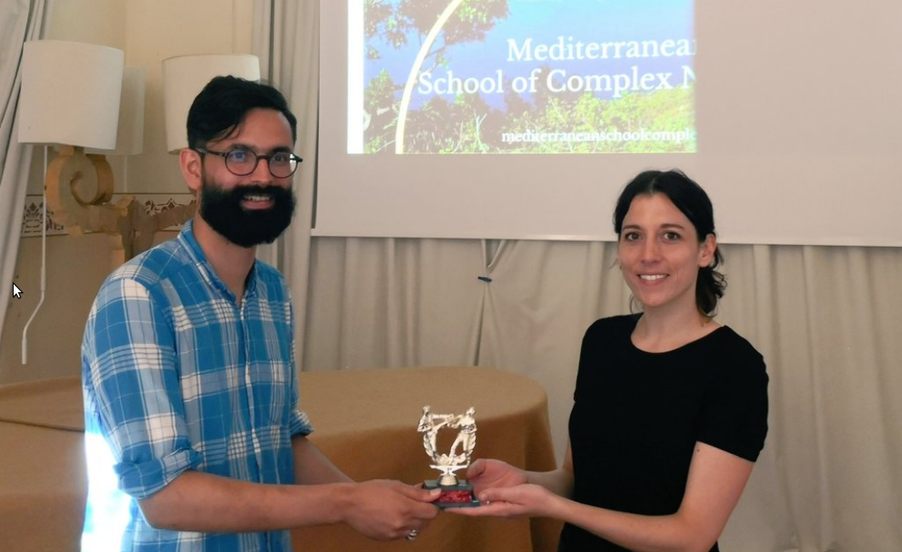

### The igraph package:

```{r d}
library(igraph)
```

Example data sets: a network of links between media venues and consumers.

While the example datasets are small, the ideas behind the analyses and visualizations apply to medium and large-scale networks.

-
---

### Tree

A tree is a directed graph with no loops. When no root is chose they are usually represented like this:

.pull-left[
```{r tree_unrooted,fig.show="hide"}
tr <-make_tree(40,children=3,mode="undirected")
plot(tr)
```
]

.pull-right[
`)
]

---

### Tree

A tree is a directed graph with no loops. But more often, a root is chosen, which will be use at the `top` of the `tree` (the `root` of  a rotated `tree`.

.pull-left[
```{r tree_rooted,fig.show="hide"}
tr <-make_tree(40,children=3,mode="undirected")
plot(tr,layout=layout_as_tree(tr,root=1))
```
]

.pull-right[
`)
]

---

### Full graph

A full graph is a graph where all node are connected

.pull-left[
```{r fullgraph,fig.show="hide"}
fg <-make_full_graph(40)
plot(fg)
```
]

.pull-right[
`)
]

---

### Small-world 

Watts-Strogatz  model Creates a lattice (with `dim` dimensions and `size` nodes across dimension) and rewires edges randomly with probability `p`. The neighborhood in which edges are connected is `nei`. You can allow `loops` and `multiple` edges.

.pull-left[
```{r smallworld,fig.show="hide"}
sw <- sample_smallworld(dim=2, size=10, nei=1, p=0.1)
plot(sw, vertex.size=6, vertex.label=NA, layout=layout_in_circle)
```
]

.pull-right[
`)
]

---

### Scale-free graphs

Using Barabasi-Albert preferential attachment model
(`n` is number of nodes, `power` is the power of attachment (`1` is linear); `m` is the number of edges added on each time step)

.pull-left[

```{r scalefree,fig.show="hide"}
 ba <-  sample_pa(n=100, power=1, m=1,  directed=F)
 plot(ba, vertex.size=6, vertex.label=NA)
```
]

.pull-right[
`) 
]

---

### The Zachary's Karate Club

Links between 34 members of a karate club. Given the club's small size, each club member knew
everyone else. Sociologist Wayne Zachary documented 78 pairwise links  between members who regularly interacted outside the club.

--
.pull-left[

]
--
.pull-right[

]

---

### The Zachary's Karate Club

.pull-left[

Conflit and split:

- A conflict between the club’s president and the instructor split the club into two.
- About half of the members followed the instructor ad the other half the president, a breakup that
unveiled the ground truth, representing club's underlying community structure.
- Today community finding algorithms are often tested based on their ability to infer these two communities from the structure of the network before the split.
]
--
.pull-right[

]

---


### The club of Zachary's karate club

.pull-left[
<blockquote class="twitter-tweet"><p lang="en" dir="ltr">This is the icing on the cake! I received the Zachary Karate Club Club trophy 🏆 for my talk in <a href="https://twitter.com/MscxNetworks?ref_src=twsrc%5Etfw">@MscxNetworks</a>! Thank you <a href="https://twitter.com/PiratePeel?ref_src=twsrc%5Etfw">@PiratePeel</a> for carrying it with you to Salina! <a href="https://t.co/153e3LBU9W">pic.twitter.com/153e3LBU9W</a></p>&mdash; Clara GM (@claragranell) <a href="https://twitter.com/claragranell/status/1038022679545176064?ref_src=twsrc%5Etfw">September 7, 2018</a></blockquote> <script async src="https://platform.twitter.com/widgets.js" charset="utf-8"></script> 
]
.pull-right[

]


<blockquote class="twitter-tweet"><p lang="en" dir="ltr">Congrats <a href="https://twitter.com/fede7j?ref_src=twsrc%5Etfw">@fede7j</a> , new recipient of the most prestigious prize in net science: the Zachary karate club <a href="https://twitter.com/hashtag/CCS16?src=hash&amp;ref_src=twsrc%5Etfw">#CCS16</a> <a href="https://t.co/7Q4yGQ6VAT">pic.twitter.com/7Q4yGQ6VAT</a></p>&mdash; Manlio De Domenico (@manlius84) <a href="https://twitter.com/manlius84/status/778130905470734336?ref_src=twsrc%5Etfw">September 20, 2016</a></blockquote> <script async src="https://platform.twitter.com/widgets.js" charset="utf-8"></script> 


---

### Visualisation

```{r , echo=F}
lay=layout_with_fr(zach)
par(mar=rep(0,4))
```

.pull-left[
```{r, zachary1,fig.show="hide"}
zach <- make_graph("Zachary")
plot(zach,vertex.size=30,layout=lay,xlim=range(lay[,1]),ylim=range(lay[,2]),rescale=F)

```
]

.pull-right[

`)

]

---

### Who are  the 'important' nodes? 

Degree of the nodes


.pull-left[
```{r degree}
degree(zach)
```
```{r plotdegree,echo=F,fig.show="hide"}
dgre=degree(zach)
V(zach)$color=dgre
zach$palette=rev(colorRampPalette(c("red","blue"))(max(dgre)))
plot(zach,vertex.size=degree(zach)/sum(degree(zach))*200,layout=lay,xlim=range(lay[,1]),ylim=range(lay[,2]),rescale=F)

zach <- make_graph("Zachary")
```

]

.pull-right[

`)


]

[//]: # (```{r})
[//]: # (ggraph(zach, 'igraph', layout=lay,circular = F) + )
[//]: # (geom_edge_link() +)
[//]: # (coord_fixed() + )
[//]: # (geom_node_point( color = 'steelblue', size = degree(zach)) +)
[//]: # (ggforce::theme_no_axes())
[//]: # (```)

---

### Who are  the 'important' nodes? 

betweenness centrality: number of shortest paths through a vertex

Cutoff: maximum path length to consider when calculating betweenness.

.pull-left[

```{r }
betweenness.estimate(zach,cutoff=3)
```

```{r plotbetweeness3,echo=F,fig.show="hide"}
btw=betweenness.estimate(zach,cutoff=3)
plot(zach,vertex.size=30,layout=lay,rescale=F,xlim=range(lay[,1]),ylim=range(lay[,2]))
```
]

.pull-right[

`)

]


---

### Who are  the 'important' nodes? 

betweenness centrality: number of shortest paths through a vertex

Cutoff: maximum path length to consider when calculating betweenness.

.pull-left[

```{r }
betweenness.estimate(zach,cutoff=3)
```

```{r plotbetweeness2,echo=F,fig.show="hide"}
btw=betweenness.estimate(zach,cutoff=3)
plot(zach,vertex.size=btw/sum(btw)*300,layout=lay,xlim=range(lay[,1]),ylim=range(lay[,2]),rescale=F)

```
]

.pull-right[

`)

]


---


### Who are  the 'important' nodes? 

betweenness centrality: number of shortest paths through a vertex

Cutoff: maximum path length to consider when calculating betweenness.

.pull-left[

```{r betweeness}
betweenness.estimate(zach,cutoff=3)
```

```{r plotbetweeness,echo=F,fig.show="hide"}
btw=betweenness.estimate(zach,cutoff=3)
V(zach)$color=btw
zach$palette=rev(colorRampPalette(c("red","blue"))(max(btw)))
plot(zach,vertex.size=btw/sum(btw)*300,layout=lay,xlim=range(lay[,1]),ylim=range(lay[,2]),rescale=F)

zach <- make_graph("Zachary")
```
]

.pull-right[

`)

]


---

### Layout 


.pull-left[

```{r lgl,fig.show="hide"}
plot(zach, layout=layout_with_lgl)
```

`)
]

--

.pull-right[

```{r lgl1,fig.show="hide"}
plot(zach, layout=layout_with_lgl(zach,root=1))
```

`)

]

--

The LGL algorithm is meant for large, connected graphs. Can specify a root node to be placed in the middle.


---

### Another dataset

```{r,eval=F}
nodes <- read.csv("Media_nodes.csv", header = T, as.is = T)
links <- read.csv("Media_edges.csv", header = T, row.names=1)
```

---

### Anaylise Degree 

```{r}
 deg <- degree(zach)
hist(deg, breaks=1:vcount(zach)-1, main="Histogram of node degree: Zach")
```
---

### Community Detection
Community detection based on edge betweenness: High-betweenness edges are removed sequentially (recalculating at each step) and the best partitioning of the network is selected.

```{r}
 ceb <- cluster_edge_betweenness(zach)
 dendPlot(ceb, mode="hclust")
```

---

### Visualize results:

.pull-left[
```{r}
plot(ceb,zach)
```
]
--
.pull-left[

]
---

class: center 

background-image: url("https://media.giphy.com/media/W9wHF6yVazlrW/giphy.gif") 

background-size: 100% 

---

### Network exercice

```{r}
library(twitteR)
consumer_key <- 'y6MIrO42nhoTXUCu0pNfqHFzO'
consumer_secret <- 'Pox03uDySk72Jl9bfJtDJ6bAUaWz0POKbA28W8WQwiX3hNUdFo'
access_token <- '1171319695-AxcUO9frORjQJdgdqPs6G6g4Rp7kBZAovxjsUyD'
access_secret <- 'Ml9lhH1VKAEwV3K4BLkUMB3jerlrA4znphttMT9Z3ijL7'
setup_twitter_oauth(consumer_key,
                    consumer_secret,
                    access_token,
                    access_secret)
token <- create_token(app="anthro-twitter",
                      consumer_key=consumer_key,
                      consumer_secret=consumer_secret,
                      access_token = access_token,
                      access_secret = access_secret
                      )

ourdataset <- searchTwitter("#ANTHutk2020", n=3000)

nonretweet  <- lapply(ourdataset,function(i)if(!i$isRetweet)i )
nonretweet= nonretweet[!sapply(nonretweet,is.null)]


names(nonretweet) = lapply(nonretweet,"[[","screenName")


allretweets=lapply(nonretweet,function(i)lapply(retweets(i$id),"[[","screenName"))
allfavorites=lapply(nonretweet,function(i)lapply(favorites(i$id),"[[","screenName"))
allreplies=lapply(ourdataset,"[[","replyToSN")
names(allreplies)=lapply(ourdataset,"[[","screenName")
allreplies= allreplies[sapply(allreplies,function(i)length(i))>0]
allretweets=allretweets[sapply(allretweets,length)>0]

activessers=unique(sapply(ourdataset,"[[","screenName"))

for(user in activessers)


```

---

### TBC


