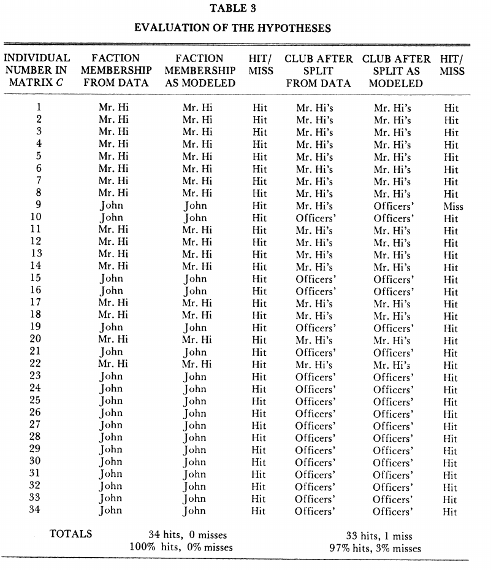

### The igraph package:

Throughout this session we will use the package igraph to do our analysis

```{r}
library(igraph)
```

There are plenty of other well known packages and program to do so such as:

- [networkx](https://networkx.github.io/): in python package
- [Gephi](https://gephi.org/) a powerful and intuitive graphical interface 

---


### Tree

A tree is a directed graph with no loops. When no root is chose they are usually represented like this:

.pull-left[
```{r tree_unrooted,fig.show="hide"}
tr <-make_tree(40,children=3,mode="undirected")
plot(tr)
```

A graph made by 40 nodes, each node having maximum 3 children


]

--

.pull-right[
`)
]

---

### Tree

A tree is a directed graph with no loops. But more often, a root is chosen, which will be use at the `top` of the `tree` (the `root` of  a rotated `tree`.

.pull-left[
```{r tree_rooted,fig.show="hide"}
tr <-make_tree(40,children=3,mode="undirected")
plot(tr,layout=layout_as_tree(tr,root=1))
```

]

.pull-right[
`)
]

---

### Full graph

A full graph is a graph where all nodes are connected

.pull-left[
```{r fullgraph,fig.show="hide"}
fg <-make_full_graph(40)
plot(fg)
```

Generate a 40 nodes graph where each node is fully connected.

```{r}
degree(fg)

mean(degree(fg))
```

]

--

.pull-right[
`)
]

---

### Full graph

A full graph is a graph where all node are connected

.pull-left[

```{r shortespathFG,fig.show="hide"}
sp12=shortest_paths(fg,1,2)
print(sp12$vpath[[1]])
E(fg,path=sp12$vpath[[1]])$color="red"
plot(fg)
```


]

--

.pull-right[
`)
]

---

### Full graph

A full graph is a graph where all node are connected

.pull-left[
```{r shortespathFG2,fig.show="hide"}
sp34=shortest_paths(fg,3,4)
print(sp34$vpath[[1]])
E(fg,path=sp34$vpath[[1]])$color="blue"
plot(fg)
```
]

--

.pull-right[
`)
]

---

### Small-world 


Watts-Strogatz model creates a lattice (with `dim` dimensions and `size` nodes across dimension) and rewires edges randomly with probability `p`. The neighborhood in which edges are connected is `nei`. You can allow `loops` and `multiple` edges.

.pull-left[
```{r smallworld,fig.show="hide"}
sw <- sample_smallworld(dim=2, size=6, nei=1, p=0.1)
plot(sw, vertex.size=6, vertex.label=NA, layout=layout_in_circle)

degree(sw)

mean(degree(sw))

```

A `r length(V(sw))` nodes graph connected as a "small world".

]

.pull-right[
`)
]

---

### Small-world 

#### Shortest Path 

.pull-left[
```{r shortpathSW,fig.show="hide"}
sp112=shortest_paths(sw,1,12)
print(sp112$vpath[[1]])
E(sw,path=sp112$vpath[[1]])$color="red"
plot(sw, vertex.size=6, layout=layout_in_circle)
```
]

--
.pull-right[
`)
]

---

### Small-world 

#### Shortest Path 

.pull-left[
```{r shortpathSW2,fig.show="hide"}
sp534=shortest_paths(sw,5,34)
print(sp534$vpath[[1]])
E(sw,path=sp534$vpath[[1]])$color="blue"
plot(sw, vertex.size=6, layout=layout_in_circle)
```
]

--
.pull-right[
`)
]


---

### Scale-free graphs

Using Barabasi-Albert preferential attachment model
(`n` is number of nodes, `power` is the power of attachment (`1` is linear); `m` is the number of edges added on each time step)

.pull-left[

```{r scalefree,fig.show="hide"}
 ba <-  sample_pa(n=100, power=1, m=1,  directed=F)
 plot(ba, vertex.size=6, vertex.label=NA)
```
```{r}
degree(ba)

mean(degree(ba))
```
]

.pull-right[
`) 
]

---
### Scale-free graphs

#### Shortest path

.pull-left[
```{r scalefree1,fig.show="hide"}
sp162=shortest_paths(ba,1,62)
print(sp162$vpath[[1]])
E(ba,path=sp162$vpath[[1]])$color="red"
plot(ba, vertex.size=2)
```
]
--
.pull-right[
`) 
]

---


### Scale-free graphs

#### Shortest path

.pull-left[
```{r scalefree2,fig.show="hide"}
sp8034=shortest_paths(ba,80,34)
print(sp8034$vpath[[1]])
E(ba,path=sp8034$vpath[[1]])$color="blue"
plot(ba, vertex.size=2)
```
]
--

.pull-right[
`) 
]

What is the main difference between those scale free network and the small world networks? Could you quantify and visualize it?


---

### The Zachary's Karate Club


Links between 34 members of a karate club. Given the club's small size, each club member knew
everyone else. Sociologist Wayne Zachary documented 79 pairwise links  between members who regularly interacted outside the club.

--

.pull-left[

]
--
.pull-right[

]


---

### The Zachary's Karate Club

.pull-left[

Conflit and split:

- A conflict between the club’s president and the instructor split the club into two.
- About half of the members followed the instructor ad the other half the president, a breakup that
unveiled the ground truth, representing club's underlying community structure.
- Today community finding algorithms are often tested based on their ability to infer these two communities from the structure of the network before the split.
]
--
.pull-right[

]

---


### The club of Zachary's karate club

.pull-left[
<blockquote class="twitter-tweet"><p lang="en" dir="ltr">This is the icing on the cake! I received the Zachary Karate Club Club trophy 🏆 for my talk in <a href="https://twitter.com/MscxNetworks?ref_src=twsrc%5Etfw">@MscxNetworks</a>! Thank you <a href="https://twitter.com/PiratePeel?ref_src=twsrc%5Etfw">@PiratePeel</a> for carrying it with you to Salina! <a href="https://t.co/153e3LBU9W">pic.twitter.com/153e3LBU9W</a></p>&mdash; Clara GM (@claragranell) <a href="https://twitter.com/claragranell/status/1038022679545176064?ref_src=twsrc%5Etfw">September 7, 2018</a></blockquote> <script async src="https://platform.twitter.com/widgets.js" charset="utf-8"></script> 
]
.pull-right[

<blockquote class="twitter-tweet"><p lang="en" dir="ltr">Congrats <a href="https://twitter.com/fede7j?ref_src=twsrc%5Etfw">@fede7j</a> , new recipient of the most prestigious prize in net science: the Zachary karate club <a href="https://twitter.com/hashtag/CCS16?src=hash&amp;ref_src=twsrc%5Etfw">#CCS16</a> <a href="https://t.co/7Q4yGQ6VAT">pic.twitter.com/7Q4yGQ6VAT</a></p>&mdash; Manlio De Domenico (@manlius84) <a href="https://twitter.com/manlius84/status/778130905470734336?ref_src=twsrc%5Etfw">September 20, 2016</a></blockquote> <script async src="https://platform.twitter.com/widgets.js" charset="utf-8"></script> 
]


---

### Visualisation

```{r , echo=F}
lay=layout_with_fr(zach)
par(mar=rep(0,4))
```

.pull-left[
```{r, zachary1,fig.show="hide"}
zach <- make_graph("Zachary")
plot(zach,vertex.size=30,layout=lay,xlim=range(lay[,1]),ylim=range(lay[,2]),rescale=F)

```
]

.pull-right[

`)

]

---

### Who are  the 'important' nodes? 

Degree of the nodes


.pull-left[
```{r degree}
degree(zach)
```
```{r plotdegree,echo=F,fig.show="hide"}
dgre=degree(zach)
V(zach)$color=dgre
zach$palette=rev(colorRampPalette(c("red","blue"))(max(dgre)))
plot(zach,vertex.size=degree(zach)/sum(degree(zach))*200,layout=lay,xlim=range(lay[,1]),ylim=range(lay[,2]),rescale=F)

zach <- make_graph("Zachary")
```

]

.pull-right[

`)


]

[//]: # (```{r})
[//]: # (ggraph(zach, 'igraph', layout=lay,circular = F) + )
[//]: # (geom_edge_link() +)
[//]: # (coord_fixed() + )
[//]: # (geom_node_point( color = 'steelblue', size = degree(zach)) +)
[//]: # (ggforce::theme_no_axes())
[//]: # (```)

---

### Who are  the 'important' nodes? 

betweenness centrality: number of shortest paths through a vertex

Cutoff: maximum path length to consider when calculating betweenness.

.pull-left[

```{r }
betweenness.estimate(zach,cutoff=3)
```

```{r plotbetweeness3,fig.show="hide"}
btw=betweenness.estimate(zach,cutoff=3)
plot(zach,vertex.size=30,layout=lay,rescale=F,xlim=range(lay[,1]),ylim=range(lay[,2]))
```
]

.pull-right[

`)

]


---

### Who are  the 'important' nodes? 

betweenness centrality: number of shortest paths through a vertex

Cutoff: maximum path length to consider when calculating betweenness.

.pull-left[

```{r }
betweenness.estimate(zach,cutoff=3)
```

```{r plotbetweeness2,fig.show="hide"}
btw=betweenness.estimate(zach,cutoff=3)
plot(zach,vertex.size=btw/sum(btw)*300,layout=lay,xlim=range(lay[,1]),ylim=range(lay[,2]),rescale=F)

```
]

.pull-right[

`)

]


---


### Who are  the 'important' nodes? 

betweenness centrality: number of shortest paths through a vertex

Cutoff: maximum path length to consider when calculating betweenness.

.pull-left[

```{r betweeness}
betweenness.estimate(zach,cutoff=3)
```

```{r plotbetweeness,,fig.show="hide"}
btw=betweenness.estimate(zach,cutoff=3)
V(zach)$color=btw
zach$palette=rev(colorRampPalette(c("red","blue"))(max(btw)))
plot(zach,vertex.size=btw/sum(btw)*300,layout=lay,xlim=range(lay[,1]),ylim=range(lay[,2]),rescale=F)

zach <- make_graph("Zachary")
```
]

.pull-right[

`)

]


---

### Layout 


.pull-left[

```{r lgl,fig.show="hide"}
plot(zach, layout=layout_with_lgl)
```

`)
]

--

.pull-right[

```{r lgl1,fig.show="hide"}
plot(zach, layout=layout_with_lgl(zach,root=1))
```

`)

]

--

The LGL algorithm is meant for large, connected graphs. Can specify a root node to be placed in the middle.


---

### Anaylise Degree 

```{r}
 deg <- degree(zach)
hist(deg, breaks=1:vcount(zach)-1, main="Histogram of node degree: Zach")
```
---

### Community Detection
Community detection based on edge betweenness: High-betweenness edges are removed sequentially (recalculating at each step) and the best partitioning of the network is selected.

```{r}
 ceb <- cluster_edge_betweenness(zach)
 dendPlot(ceb, mode="hclust")
```

---

### Visualize results:

.pull-left[
```{r}
plot(ceb,zach)
```
]
--
.pull-left[

]

---


### Network exercice

Redo all previous metrics but with different networks.  

* On recent tools to search for new dataset has been setup by google: https://datasetsearch.research.google.com


* Another one specialised on networks: http://networkrepository.com/ for exemple : soc-tribes (which describes the data from this paper: https://www.journals.uchicago.edu/doi/pdfplus/10.1086/soutjanth.10.1.3629074) ([here](#soctribes))


* Using `rtweet`  to collect data ([here](#rtweet))

---


###  Soc-tribes dataset

`Soc-tribes` (found here:http://networkrepository.com/soc-tribes.php),  describes the data from [this paper](https://www.journals.uchicago.edu/doi/pdfplus/10.1086/soutjanth.10.1.3629074)

You can download this particular dataset directly [here](data/soc-tribes.edges) 

.pull-left[
Once you have the data set ( in a subfolder called `data/` in my case) you can read it doing:
```{r}
soc=read.table("data/soc-tribes.edges")
```

This is a simple `edgelist`, a standard way to encode network:
```{r,echo=T,message=F,eval=F}
soc[1:3,]
```

```{r,echo=F}
knitr::kable(soc[1:3,],format="html")
```

Igraph can easily read it:

```{r socnet,fig.show="hide"}
soc=graph.data.frame(soc)
plot(soc)
```
]

--

.pull-right[
`)
]

```{r,eval=F,echo=F}
library(rtweet)
consumer_key <- 'y6MIrO42nhoTXUCu0pNfqHFzO'
consumer_secret <- 'Pox03uDySk72Jl9bfJtDJ6bAUaWz0POKbA28W8WQwiX3hNUdFo'
access_token <- '1171319695-0JePam7aGcpyGD5EtYZp3TnnjqXpBeKoomLmgvf'
access_secret <- 'R5szPm9apkJL34Cr3rcYEjFjZHEE4caro1d0l8HQ5BZxh'
token <- create_token(app="anthro-twitter",
                      consumer_key=consumer_key,
                      consumer_secret=consumer_secret,
                      access_token = access_token,
                      access_secret = access_secret
                      )
```

---

### Getting a network of interaction from twitter

(for more information about rtweet visit [rtweet.info](https://rtweet.info))

Load `rtweet` library and prepare API access

```{r , eval=F,echo=T}
library(rtweet)
consumer_key <- ''
consumer_secret <- ''
access_token <- ''
access_secret <- ''
token <- create_token(app="appname",
                      consumer_key=consumer_key,
                      consumer_secret=consumer_secret,
                      access_token = access_token,
                      access_secret = access_secret
                      )
```

* If you don't remeber how to setup all this go to [this section of the lab](http://www.nimbios.org/~simon/bd4ss/big-data-lab-february-06-twitter-data.html#extra-using-twitter-api-to-retrieve-tweets.)
* If you don't want or were not able to set-up your twitter account and still want to play with this dataset you can download it [here](data/network.csv) and use: `network=read.csv("data/networkATNH.csv")` to load it and then start the analysis

---

### Create and Explore a dataset


Collect all tweets :
```{r,eval=F}
ourdataset <- search_30day("#ANTHutk2020", n=3000,env_name="dev") 
```


Get all user that participated to the hashtag (we collect people that where quoted etc.. to have more data)
```{r}
allactive_users=unique(
                       c(
                         ourdataset$user_id, #user active on this hashtag
                         ourdataset$retweet_user_id, #user who retweeted a tweet with the hashtag
                         ourdataset$reply_to_user_id, #users who answered to a tweet with the hashtag
                         unlist(ourdataset$mentions_user_id), #users who where mentionned in a tweet
                         ourdataset$quoted_user_id #users who where quoted with the hashtag
                         ) 
                       )
allactive_users=allactive_users[!is.na(allactive_users)] #remove NA
```

Get all followers and all favs for all users (if you want to use another list of user just replace here `allactive_users` by your own list of twitter handles ):


```{r ,include=F}
load("data/all_fav.bin")
load("data/all_followers.bin")
```

```{r ,eval=F}
all_followers=lapply(allactive_users,get_followers)
all_fav=lapply(allactive_users,get_favorites)
names(all_fav)=allactive_users
names(all_followers)=allactive_users
```

---


### Create and Explore a dataset

Create an edgelist of who interacted, favs, follows, who:

```{r,message=F,eval=F}
edgelist=c()
for(i in allactive_users){
    for(j in allactive_users[allactive_users != i]){
        j_fav= all_fav[[j]]
        favs=sum(i == j_fav$user_id )
        if(!is.na(favs) & favs>0){
            edgelist=rbind(edgelist,c(j,i,favs)) #j liked one or more i's tweets
        }
        j_folwrs= all_followers[[j]]
        if(i %in% j_folwrs$user_id ){
            edgelist=rbind(edgelist,c(i,j,1)) #i is following j

        }
    }
    for (t in 1:nrow(ourdataset)){
        tweet=ourdataset[t,]
        j=tweet$user_id
        if( i %in% tweet$retweet_user_id)
            edgelist=rbind(edgelist,c(j,i,1)) #j retweeted i
        if( i %in% tweet$reply_to_user_id)
            edgelist=rbind(edgelist,c(j,i,1)) #j replied to i
        if( i %in% tweet$quoted_user_id)
            edgelist=rbind(edgelist,c(j,i,1)) #j quoted i
    }
}
```


---


### Transform our data in a edgelist

Transform this list to a dataframe:

```{r}
edgelist=as.data.frame(edgelist)
edgelist$V3=as.numeric(edgelist$V3)
```

Our data set as an edgelist:

```{r tab:edge,echo=F}
knitr::kable(edgelist[1:11,],format="html")
```

---


### Transform edglist as a network

.pull-left[

We sum together the same "edges"
```{r }
network=aggregate(edgelist$V3,by=list(source=edgelist$V1,dest=edgelist$V2),sum)
```

Transform this dataframe as a network:

```{r fig:net,fig.show="hide"}
anthnetwork=graph.data.frame(network)
V(anthnetwork)$name = sample.int(length(V(anthnetwork))) #change ID of nodes
plot(anthnetwork,edge.width=network$x) #use the sum of interaction to setup width of edges
```
]

.pull-right[

`)

]


---

### Usefull tricks

Something that can be usefull from rtweet:


```{r}
user_info=lookup_users("1171319695")
```

This will gives you info about the user with id: 1171319695
you can user: `user_info$screen_name` to get the `screen_name` of this user in this case:
```{r}
user_info$screen_name
```
This work with list of users id, thus you can try something like: 

```{r, eval=F}
allusers=lookup_users(listaactivesusers)
allusers$screen_name
```

```{r, eval=F,include=F}
anthnetwork=graph.data.frame(network)
V(anthnetwork)$name=lookup_users(V(anthnetwork)$name)$screen_name
plot(anthnetwork,edge.width=network$x) #use the som of interaction to setup width of edges
```


---

### Hamilton dataset

Another interesting dataset is available [here](https://securingdemocracy.gmfus.org/the-methodology-of-the-hamilton-68-dashboard/). Among other things it gives access to a list of twitter users that we simplified and you can download [here](data/hamilton2.0.csv).
Using that we can try to slighlty modify our code to generate another network:

```{r,message=F,eval=F}
hamiltonusers=read.csv("data/hamilton2.0.csv")[1:11,1]
hamiltonusers_uid=lookup_users(as_screenname(hamiltonusers))$user_id

hamilton_followers=lapply(hamiltonusers_uid,function(u)
                     {
                         Sys.sleep(2) 
                         get_followers(u)
                     })
hamilton_fav=lapply(hamiltonusers_uid,function(u)
                     {
                         Sys.sleep(2) 
                         get_favorites(u)
                     })
names(hamilton_fav)=hamiltonusers_uid
names(hamilton_followers)=hamiltonusers_uid

edgelist_hamilton=c()
for(i in hamiltonusers_uid){
    for(j in hamiltonusers_uid[hamiltonusers_uid != i]){
        j_fav= all_fav[[j]]
        favs=sum(i == j_fav$user_id )
        if(!is.na(favs) & favs>0){
            edgelist_hamilton=rbind(edgelist_hamilton,c(j,i,favs)) #j liked one or more i's tweets
        }
        j_folwrs= hamilton_followers[[j]]
        if(i %in% j_folwrs$user_id ){
            edgelist_hamilton=rbind(edgelist_hamilton,c(i,j,1)) #i is following j

        }
    }
    #as we don't have a list of actual "tweets" by those users we can only look at who follows and likes who
}
```


---


Now that you have various dataset you can use them to redo all analyse we did for the zachary karate club


