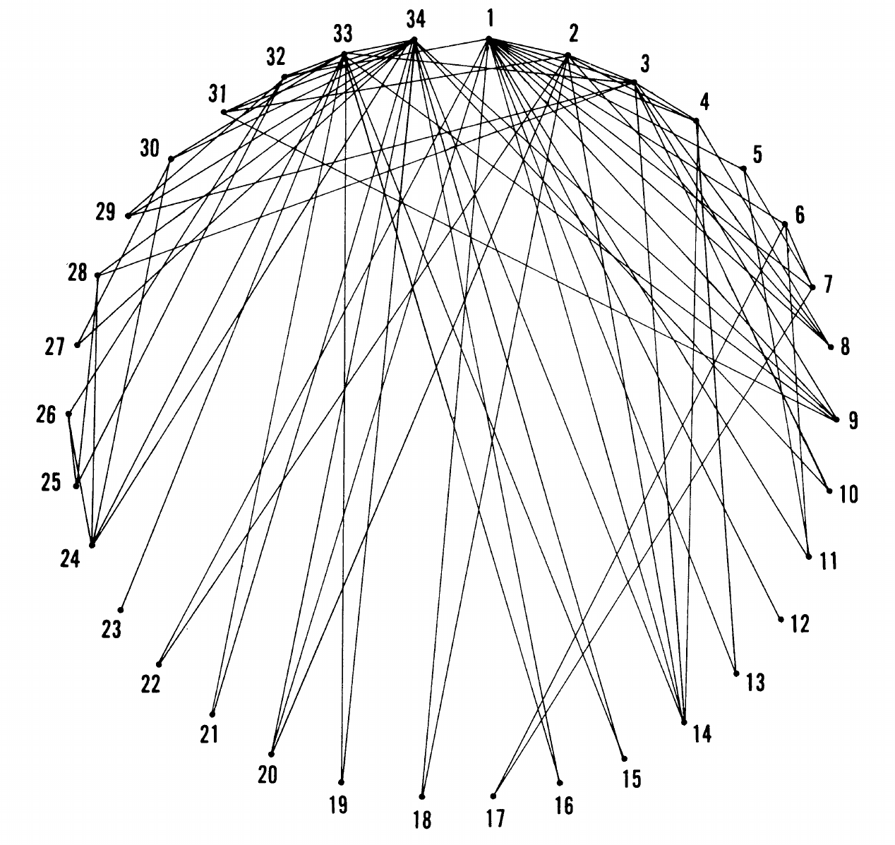

## The igraph package:

```{r d}
library(igraph)
```

Example data sets: a network of links between media venues and consumers.

While the example datasets are small, the ideas behind the analyses and visualizations apply to medium and large-scale networks.

-
---

## Tree

A tree is a directed graph with no loops. When no root is chose they are usually represented like this:

.pull-left[
```{r tree_unrooted,fig.show="hide"}
tr <-make_tree(40,children=3,mode="undirected")
plot(tr)
```
]

.pull-right[
`)
]

---

## Tree

A tree is a directed graph with no loops. But more often, a root is chosen, which will be use at the `top` of the `tree` (the `root` of  a rotated `tree`.

.pull-left[
```{r tree_rooted,fig.show="hide"}
tr <-make_tree(40,children=3,mode="undirected")
plot(tr,layout=layout_as_tree(tr,root=1))
```
]

.pull-right[
`)
]

---

## Full graph

A full graph is a graph where all node are connected

.pull-left[
```{r fullgraph,fig.show="hide"}
fg <-make_full_graph(40)
plot(fg)
```
]

.pull-right[
`)
]

---

## Small-world 

Watts-Strogatz  model Creates a lattice (with `dim` dimensions and `size` nodes across dimension) and rewires edges randomly with probability `p`. The neighborhood in which edges are connected is `nei`. You can allow `loops` and `multiple` edges.

.pull-left[
```{r smallworld,fig.show="hide"}
sw <- sample_smallworld(dim=2, size=10, nei=1, p=0.1)
plot(sw, vertex.size=6, vertex.label=NA, layout=layout_in_circle)
```
]

.pull-right[
`)
]

---

## Scale-free graphs

Using Barabasi-Albert preferential attachment model
(`n` is number of nodes, `power` is the power of attachment (`1` is linear); `m` is the number of edges added on each time step)

.pull-left[

```{r scalefree,fig.show="hide"}
 ba <-  sample_pa(n=100, power=1, m=1,  directed=F)
 plot(ba, vertex.size=6, vertex.label=NA)
```
]

.pull-right[
`) 
]

---

## The Zachary's Karate Club

Links between 34 members of a karate club. Given the club's small size, each club member knew
everyone else. Sociologist Wayne Zachary documented 78 pairwise links  between members who regularly interacted outside the club.

.pull-left[

]

.pull-right[

]

---

## The Zachary's Karate Club

.pull-left[

Conflit and split:

- A conflict between the club’s president and the instructor split the club into two.
- About half of the members followed the instructor ad the other half the president, a breakup that
unveiled the ground truth, representing club's underlying community structure.
- Today community finding algorithms are often tested based on their ability to infer these two communities from the structure of the network before the split.
]

.pull-right[

]

---

## Visualisation

.pull-left[
```{r, zachary1,fig.show="hide"}
zach <- make_graph("Zachary")
plot(zach,vertex.size=10)
```
]

.pull-right[

`)

]
